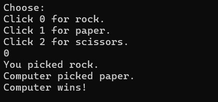

Rock Paper Scissors in C

A simple Rock Paper Scissors game written in C.

Overview:

This is my first C programming project. The program allows the user to choose Rock, Paper, or Scissors by entering a number. The computer then generates a random choice, and the winner is determined according to the standard rules of the game.

Traditional Game Rules:

- Rock beats Scissors.
- Paper beats Rock.
- Scissors beats Paper.
- If both the player and the computer choose the same option, the result is a draw.

Libraries Used:

<stdio.h> - Provides standard input and output functions such as printf() and scanf().

<stdlib.h> - Provides functions such as rand() and srand() that are used for random number generation.

<time.h> - Provides the time() function, which is used to generate a different seed value each time the program runs.

How the Program Works:

The user selects one of the following options:
0 - Rock
1 - Paper
2 - Scissors

The program validates the input to ensure that only valid choices are accepted.

The computer then generates a random choice using: rand() % 3

Since the remainder when dividing by 3 can only be 0, 1, or 2, this produces one of the three possible game choices.

To make the computer's choice appear random on each run, the random number generator is seeded using: srand(time(NULL));

The rand() function generates pseudo-random numbers, meaning that it produces a predictable sequence unless a different seed is provided. The time(NULL) function returns the current calendar time, which changes continuously and therefore provides a different seed value each time the program is executed.

After both choices have been made, the program uses conditional statements to determine whether the result is a draw, a player win, or a computer win.

While building this project, I learned:

1) User input using scanf()
2) Conditional statements (if, else if, else)
3) Input validation
4) Random number generation using rand()
5) Seeding random numbers using srand()
6) Using the modulus % operator
7) Basic program flow and decision making

Screenshot:

